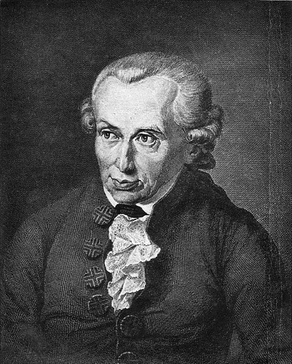

## Immanuel Kant iyo Xuduudaha Aqoonta

Qarnigii 18-aad, dunida falsafaddu waxay ku jirtay xaalad jahawareer ah oo u dhexaysay laba kooxood oo aad u kala fog. Kooxda “Caqli-ku-tiirsaneyaasha” (Rationalists) oo aaminsanaa in caqligu keligiis keeni karo aqoon saafi ah, iyo kooxda “Dareen-ku-tiirsaneyaasha” (Empiricists) oo ku doodayay in wax walba laga barto khibradda iyo dareenka shanta ah. Immanuel Kant, oo ahaa ninkii soo afjaray dooddaas, wuxuu yimid isaga oo wata fikrad gilgishay aasaaskii aqoonta, taas oo uu ugu yeeray “Kacaanka Copernicus ee Falsafadda.”

Sida Copernicus uu u beddelay fahamkii ahaa in qorraxdu ku wareegto dhulka, una caddeeyay in dhulku ku wareego qorraxda, ayuu Kant isna u beddelay qaabkii loo arkayay xiriirka ka dhexeeya maskaxda iyo dunida. Wuxuu ku dooday in maskaxdu aysan ahayn muraayad iska taagan oo si dadban u sawirata dunida dibadda, balse ay tahay “warshad” oo qaabaysa, habaysa, oo macne u yeelaysa waxa kasta oo soo gala.

Sidaa darteed, aqoontu kama timaaddo dunida oo keliya, ee waxay ka timaaddaa is-dhexgalka u dhexeeya “xogta ceeriin” ee dareemayaasha iyo “qaab-dhismeedka” maskaxda ku sii jira. Kant wuxuu si qoto dheer u falanqeeyay sida aynu wax u aragno, wuxuuna soo bandhigay fikradda ah in “Waqtiga” iyo “Goobta” aysan ahayn waxyaabo si madax-bannaan uga jira dunida dibadda, balse ay yihiin muraayado dabiici ah oo maskaxda bini’aadamka ku xiran tahay. Bal qiyaas in aad dhalatay adigoo xiran ookiyaale buluug ah; wax walba oo aad aragto waa buluug, laakiin buluugnimadu maaha sifo dhab ah oo jirta, ee waa qaabka aad adigu wax u aragto. Sidaas oo kale, Kant wuxuu leeyahay: “Wax walba oo aan la kulanno waa inaan dhex marsiinnaa shaandhada waqtiga iyo goobta.”

Ma qiyaasi kartid, mana arki kartid shay aan meelna oollin ama aan waqti ku jirin. Tani waxay ka dhigan tahay in maskaxdu aysan u duubin dunida sida ay tahay, ee ay ku qasabto dunida inay u hoggaansanto shuruudaha maskaxda. Sidaa darteed, waxaan nahay dhibbanayaasha khibraddeenna, mana nihin kaliya goobjoogayaal; waana sababta aan u leenahay aqoon guud, sida xisaabta iyo joomatariga, waayo waxay ku dhisan yihiin qaab-dhismeedka maskaxdeenna oo aan isbeddelin.

Halkaas marka ay marayso, Kant wuxuu soo kala jeexay laba caalam oo kala duwan, waana barta ugu xanuunka badan falsafaddiisa. Caalamka “Phenomena” waa muuqaalka iyo xaalka “Noumena” shayga laftiisa. Caalamka Phenomena waa dunida aan dareenno, taabanno, sawirsanno ku baranno, kuna nool nahay; waa dunida soo martay shaandhada maskaxdeena.

Laakiin dhinaca kale, waxaa jira “Noumena,” oo ah shayga dhabtiisa ah ee ka dambeya muuqaalka, waa gededka sida uu yahay marka aan qofna eegayn, ama xaqiiqda qaawan ee ka madax-bannaan dareenka aadanaha. Kant wuxuu si cad u sheegay in “Bini’aadamku uusan waligiis ogaan karin Noumena.” Sababtoo ah, isku day kasta oo aan ku dooneyno inaan ku ogaanno xaqiiqda dahsoon, waxay u baahan tahay inaan isticmaalno maskaxdeena, markaan maskaxdeena isticmaalnana, waxaan mar hore wax ka beddelnay shaygii oo waxaan ka dhignay “Phenomena.” Waxaan nahay maxaabiis ku dhex jira qol ka garaadkeena, waxaana naga dahsoon sirta kama dambaysta ah ee koonka.

Ugu dambayntii, aragtida Kant waxay saamayn weyn ku yeelatay diinta iyo anshaxa. Maadaama caqligu uu ku xiran yahay kaliya waxyaabaha waqtiga iyo goobta ku jira Phenomena, Kant wuxuu soo gabagabeeyay in Ilaahay, Nafta, iyo Xorriyadda aan lagu xaqiijin karin daliil saynis ama caqli waayo kama mid aha waxyaabaha muuqda. Laakiin Kant ma ahayn nin diinta diiddan; cagsigeeda, wuxuu yiri: “Waa inaan caqliga xad u yeelaa, si aan boos ugu banneeyo iimaanka.”

Wuxuu ku dooday in kasta oo aynaan caqli ahaan u ogaan karin Ilaahay, haddana waa inaan rumaysannaa jiritaankiisa, sababtoo ah la’aanta fikradahaas Ilaah iyo Aakhiro, nolosha anshaxa iyo damiirka bini’aadamku macno ma samaynayaan. Sidaas darteed, Kant wuxuu badbaadiyay sayniska isaga oo xad u yeelay, wuxuuna badbaadiyay diinta isaga oo ka saaray garoonka doodaha sayniska, wuxuuna na baray in garaadkeennu leeyahay xuduud uusan marnaba ka gudbi karin.
