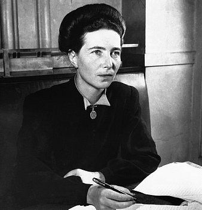

## Simone De Beauvoir "Qofku Haweeney Kuma Dhasho, Balse Wuu Noqdaa."

Weligaa ma is weydiisay sababta taariikhda aadanaha inta ugu badan, ninka loogu arko inuu yahay halbeegga nolosha ama udub-dhexaadka adduunka, halka haweeneydana loo arko qofka kale ee lagu kabo nolosha ninka? Ragga taariikh ahaan waxaa loo tixgeliyaa inay yihiin kuwo madax-bannaan, iyagu doorta masiirkooda, macnaha noloshoodana gacantooda ku qorta. Balse waa maxay sababta dumarka loogu xiray doorar bulshadu u sii jeexday? Su'aalahaas cul-culus ma aha kuwo aan anigu iska keenay. Waa aasaaska falsafaddii ruxday qarnigii 20-aad ee ay la timid qoraayadii iyo faylasuufaddii u dhalatay Faransiiska ee Simone de Beauvoir. Waxay ahay haweeneydii aasaastay dhaqdhaqaaqa cusub ee u doodista xuquuqda dumarka, iyadoo adeegsanaysa falsafadda Existentialism-ka

(Falsafadda Jiritaanka Aadanaha iyo Xorriyadda).

Aan yara dhex-quusanno nolosheedii layaabka lahayd iyo fikradaheedii baddelay adduunka.

Simone waxay ku dhalatay Paris sannadkii 1908-dii, iyadoo ka soo jeedda qoys ladan. Sidii caadada u ahayd xılligaas, aabaheed wuxuu rajaynayay inay hesho waxbarasho fiican si ay ula aqal-gasho nin taajir ah, reerna u dhaqdo. Balse qaddarku waddo kale ayuu u jeexay. Markii ay qaan-gaartay, qoyskeedii wuu kacay, hantidiina waa ay beeleen. Meeshii gabdhaha badankood ay xilligaas niyad-jabi lahaayeen maadaama aysan haysan hanti ay ku guursadaan, Simone farxad ayay u ahayd! Waxay dareentay inay ka xorowday silsiladdii guurka qasabka ahaa iyo in guri lagu xiro. Waxay go'aansatay in waxbarashadeedu ay noqoto hubka kaliya ee ay ku dagaallanto. Hooyadeed waxay ahayd haweeney Katoolig ah oo diinta aad ugu adag. Simone yaraanteedii ilaa heer ay is-tiri makaa-hilaad miyaad noqotaa? ayay diinta ku dheganayd. Balse markii ay 14 jir noqotay, waxay martay isbeddel maskaxeed oo weyn; waxay ku dhawaaqday inay diinta ka baxday, waxayna nolosheeda u hurtay xisaabta, suugaanta, iyo falsafadda.

Si aad u fahamto Simone, waa inaad fahamtaa xiriirkii iyada iyo Jean-Paul Sartre oo ahaa mid ka mid ah faylasuufyadii ugu waaweynaa qarnigii 20-aad. Waxay is-barteen 1929-kii iyagoo jaamacadda wada dhigta. Waxaana dhex maray xiriir jaceyl iyo mid maskaxeed oo socday in ka badan 50 sano! Balse ma ahayn xiriir caadi ah. Sartre mar buu guur u soo bandhigay, wayna diidday. Weligood hal guri ma wada degin, carruur isuma dhalin, mid walbana wuxuu xor u ahaa inuu xiriirro kale la yeesho dad kale.

Maxay sidaas u sameeyeen? Sababtoo ah waxay aaminsanaayeen in "Xorriyaddu ay tahay shuruudda koowaad ee jaceylka dhabta ah." Xiriirkoodu wuxuu tusaale nool u ahaa aragtideeda ah in haweeneydu aysan marnaba nafteeda ku dhex lumin nin, balse ay noqoto qof madax-bannaan. Sannadkii 1949-kii, Simone waxay soo saartay buug ka kooban 1,000 bog oo la yiraahdo The Second Sex. Buuggan waa midka aasaaska u noqday kacdoonkii labaad ee dumarka. Markii buuggu soo baxay, dhaleecayn xooggan ayuu la kulmay. Kaniisadda Faatikaanka/Vatican waxay ku dartay liiska buugaagta xaaraanta ah ee la mamnuucay. Balse taasi kama celin inuu adduunka ku fido. Buuggan, Simone waxay ku burburisay dooddii ahayd "Ragga iyo dumarku way kala duwan yihiin sababo bayooloji ah awgood, waana in sidaas lagu kala dambeeyo." Iyadu waxay falanqaysay taariikhda qadiimiga ah ee Giriigga, Yurubta Dhexe, iyo dhaqamada kala duwan, waxayna ogaatay in awood-maroorsiga ragga uusan ahayn mid dabiici ah, balse uu yahay nidaam ay bulshadu curisay.

"Qofku kuma dhasho haweeney, balse wuu noqdaa." (One is not born, but rather becomes, a woman).

Tani waa weedha ugu caansan falsafaddeeda. Waa maxay macnaheedu? Simone waxay leedahay, dheddignimada, iyo hab-dhaqanka laga filayo haweeneyda kuma dhex jiraan dhiiggeeda ama hiddo-sideheeda. Waa bulshada iyo deegaanka waxa gabadha yar bara inay noqoto qof aamusan, adeegta, ninka ka dambaysa, islamarkaana isku xaddidda quruxda iyo hooyonimada. Dhanka kale, wiilka waxaa la baraa inuu noqdo madax, xor ah, oo dunida maamula. Sidaas darteed, haweeneynimadu waa door la jilayo oo bulshadu qofka u dhiibtay! Sidee bay Simone isugu xirtay u-doodista dumarka iyo falsafadda Existentialism-ka? Si fudud, falsafaddani waxay nolosha u qaybisaa laba:

1. Being-for-itself Inaad naftaada u jirto: Waa xaalad qofku u madax-bannaan yahay fekerkiisa, ficilkiisa iyo yoolkiisa. Wuxuu abuuraa isbeddel, wuuna socdaa. Taariikh ahaan, kaalintan waxaa la siiyay Ragga.

2. Being-in-itself Inaad tahay shay la maamulo: Waa xaalad qofku yahay mid go'doonsan, la daawado, la qiimeeyo, laguna xaddido shaqooyin cayiman (sida daryeelka). Kaalintan, nasiib-darro, waxaa lagu riixay Dumarka.

Simone waxay leedahay, dumarku waxay noqdeen kuwa kale, maxaa yeelay waxay oggolaadeen inay ku dhex noolaadaan qafiskaas. Si haweeneydu u xorowdo, waa inay u halgantaa sidii ay u noqon lahayd "being-for-itself". Waa inay diiddaa in doorkeeda loo sii qoro, waa inay mas'uuliyadda nolosheeda dhabarka saarataa, oo ay iyadu nafteeda u sameysaa macne. Ugu dambeyntii Simone de Beauvoir waxay na baraysaa in dhibaatada iyo cadaalad-darrada haysata dumarka aysan ahayn masiir rabaani ah oo aan la beddeli karin. Isbeddelka dhabta ah ee haweeneyda kama yimaado bannaanka; wuxuu ka yimaadaa gudaheeda. Marka ay haweeneydu garwaaqsato in aysan ahayn "shay la maamulo" balse ay tahay "maskax wax curin karta", xilligaas ayay bilowdaa inay adduunka la wareegto. Buuggeeda iyo aragtideeda waxay xudun u noqdeen in jaamacadaha reer galbeedka laga hirgeliyo cilmiga daraasaadka jinsiga ee (gender Studies), waxayna beddeshay habkii dunidu u arkayay doorka haweeneyda. Noloshu ma laha qoraal la sii diyaariyay. Sida raggu ay u xor yihiin inay mienaha noloshooda abuuraan, ayay tahay in dumarkuna ay qalinkooda u qaataan si ay u qoraan sheekadooda.

Sidaad adigu u aragtaa aragtidan? Miyaad aaminsan tahay in dabeecadaha iyo hab-dhaqanka lagu yaqaan dumarka iyo ragga ay yihiin kuwo lagu dhasho, mise waa kuwo ay bulshadu u sameysay jinsi kasta? Fadlan hoos iigula wadaag fikirkaaga iyo falanqeyntaada qeybta faallooyinka (Mahadsanid).