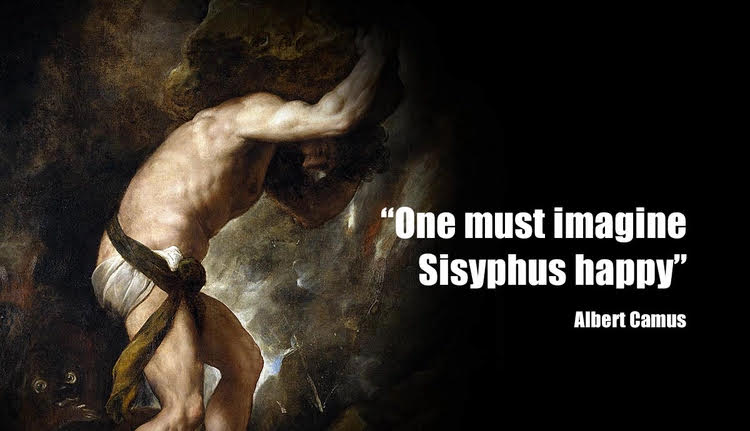
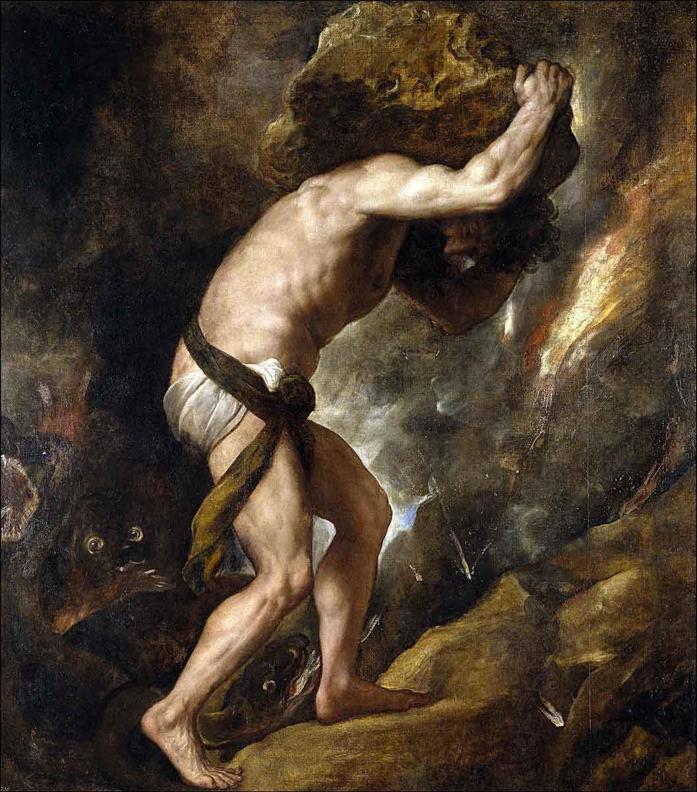
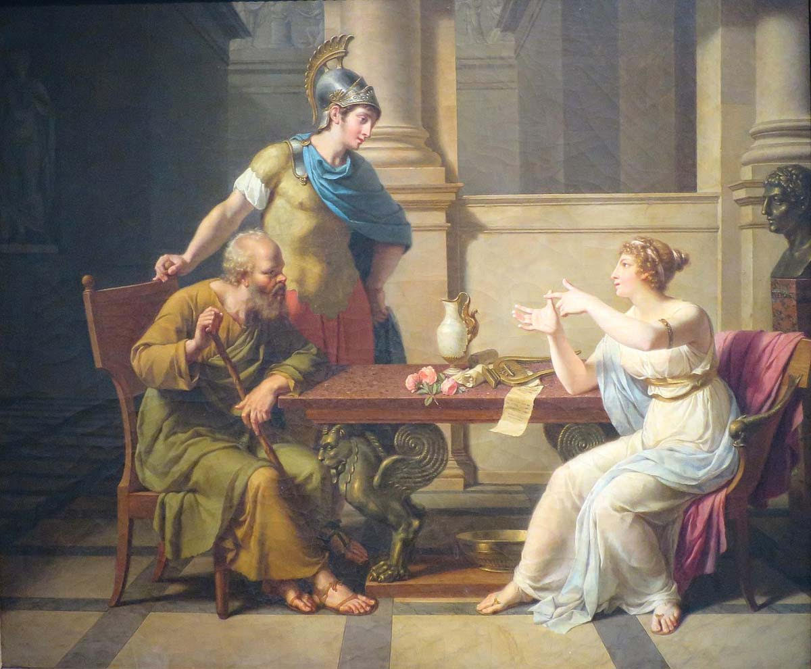
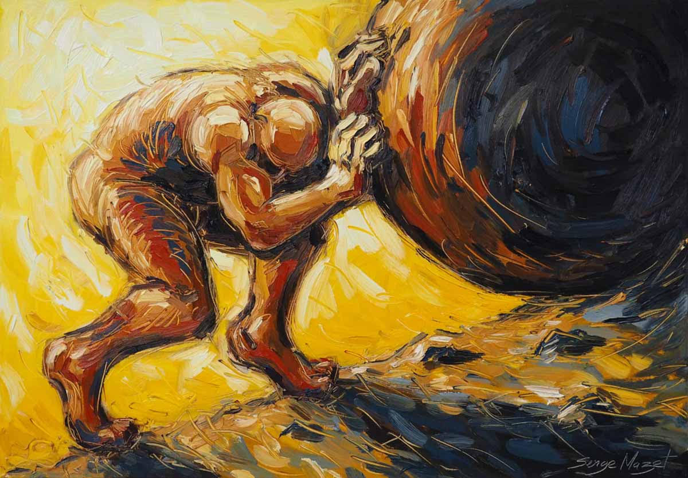

## Waa Maxay Sababta Aynu Sisyphus Ugu Qiyaasno Nin Faraxsan?

Qeylada saacadda hurdada ama alarm-ka ee subaxnimadii Isniinta. Daalkii xafiiska ee shaqada. Mushaarka oo aan dhammaadka bisha gaarin. Culeyska biilka. Wareegga shaqo-tagga iyo guri-imaadka ee maalinta xigta dib u bilaabanaya. Mararka qaar, marka aad gaariga dhex fadhido adigoo ku jira saxmad taraafiko ah oo aan dhaqaaqayn, ama aad keligaa qolkaaga dhex fadhido saq-dhexe, miyaadan naftaada weydiin

"Tani miyay tahay nolosha macnaheedu? In aan maalin walba wareeg isku mid ah oo daal badan ku dhex jirto? Maxay tahay ujeedka dhabta ah ee halgankan aan dhammaadka lahayn? Haddii aad waligaa dareenkaas gashay, hubaal keligaa ma tihid. Waa su'aal soo taxnayd ilaa bilowgii aadanaha. Faylasuufkii weynaa ee u dhashay dalka Faransiiska balse ku dhashay Aljeeriya Albert Camus, ayaa su'aashan si qoto dheer uga baaraan-degay buuggiisii caanka ahaa ee The Myth of Sisyphus. Sheeko-Xariireedkii Sisyphus ee soo baxay 1942-kii.

Camus wuxuu lafo-guray xaqiiqada qaraar ee aadanaha; in aynu baarowno, xanuunsanno, halganno, aakhirkana aynu dhimanno. Balse gunaanadka buuggiisa wuxuu ku soo xiray farriin layaab leh, kana duwan sidii ay dad badani ka filayeen. Wuxuu yiri: "Waa in aan Sisyphus ku qiyaasnaa nin faraxsan." Aan yara hakanno bal. Sidee buu ku farxi karaa nin ciqaab daa'im ah lagu riday? Si aan u fahamno sirta weedhan, waa in aan dib u milicsanno sheekada Sisyphus laftiisa iyo waxa lagu sameeyay.

Sheekadii Sisyphus

Khuraafaadkii Giriigga ee hore, Sisyphus wuxuu ahaa boqor bini-aadam ah oo aad u caqli badnaa. Wuxuu ahaa nin dhowr jeer siray ilaahyadii Giriigga, isagoo xitaa mar silsilad ku xiray geerida ama dhimashada lafteeda, taas oo sababtay in adduunka muddo dheer aan la dhiman. Markii dambe ilaahyadii way ka adkaadeen, waxayna go'aansadeen in ay mariyaan ciqaab tii ugu xumayd ee abid la maqlo. Ma aysan dilin.

Ma aysan gubin. Waxay saareen ciqaab maskaxeed. Waxay ku xukumeen in uu dhagax aad u weyn oo buur le'eg riixo, uuna koro buur dheer oo dushuba ka siman tahay. Balse shardi ayaa ku jiray xukunka: Mar kasta oo uu Sisyphus dhagaxa gaarsiiyo buurta darafkeeda, isagoo is-leh waad dhammaystirtay shaqadii, dhagaxu awooddiisa ayuu ka baxayaa, wuxuuna dib ugu fakadayaa salka hoose ee buurta..

Sisyphus waa in uu dib u noqdo, oo uu mar kale riixaa dhagaxa. Maalin walba. Sannad walba. Weligiis iyo abidkiis. Waa howl aan dhammaad lahayn, midho-dhal lahayn, macnena aan ku dhisnayn. Ilaahyadu waxay aaminsanaayeen in aysan jirin ciqaab ka weyn in qofka la faro shaqo adag oo aan wax faa'iido ah ama ujeeddo ah lahayn. Waa tusaalaha ugu dhammaystiran ee waxa cilmiga falsafadda loogu yeero "The Absurd" Macne-darrada ama Biyo-kama-dhibcaanka nololeed. Marka aynu sheckadan dusha ka eegno, waxay astaan u tahay rajo-beelka. Balse Albert Camus meel kale ayuu wax ka eegay. Isagu diiradda ma saarin dhididka, daalka, iyo silica Sisyphus xilliga uu dhagaxa riixayo. Camus wuxuu diiradda saaray waqtiga uu Sisyphus buurta ka soo degayo. Waqtigaas uu soo degayo, waa xilli uusan dhagax sidin. Waa daqiiqado ay maskaxdiisu xor tahay. Camus wuxuu leeyahay, xilligaas uu soo degayo ayaa ah waqtiga ugu muhiimsan, sababtoo ah waa xilliga ay timaado Wacyiga. Waa xilliga uu Sisyphus garwaaqsado xaqiiqada qaraar ee qaddartiisa. Wuu ogyahay in dhagaxu sugayo. Wuu ogyahay in uusan marnaba dhammayn doonin shaqadan. Balse halkii uu ka ooyi lahaa ama is-dili lahaa, in kasta oo uusan dhiman karin, wuxuu qaadanayaa go'aan geesinimo leh: Wuxuu aqbalayaa qaddartiisa. Marka aad aqbasho xaqiiqada ugu xun ee ku haysata, adigoon isku maaweelinayn rajo been ah. Sida in ilaahyadu maalin uun cafin doonaan, waxaad noqonaysaa qof madax-bannaan. Camus wuxuu qabaa, inkasta oo ilaahyadu ciqaab siiyeen, Sisyphus isagaa go'aansaday inuu dhagaxaas la falgalo. Kuma qasbana inuu quusto. Haddii ujeedka ilaahyadu ahaayeen in ay maskaxdiisa jebiyaan oo ay ka oohiyaan, farxaddiisa iyo adkaysigiisa ayaa ah hubka kaliya ee uu kaga aarsan karo. Farxaddiisu waa kacdoon. Noloshu, inkasta oo aysan lahayn macne gaar ah oo lala dhalasho, haddana isagaa macne u samaynaya socodkiisa.

"Dhagaxaygu waa arrintayda gaarka ah," ayuu Camus qoray.

Muxuu Casharkan Inooga Dhigan Yahay Hadaynu Soomaali Nahay? Marka aan ka nimaadno buugaagta Faransiiska iyo khuraafaadka Giriigga, aynu sheekadan keeno ciiddeena hooyo iyo nolosheena maalinlaha ah. Ummadda Soomaaliyeed waa tusaalaha nool ee Sisyphus. Dhammaanteen waxaan leenahay dhagax aan waligiis dhamaanayn oo aan riixno.

Dhagaxa Nolosha Miyiga iyo Abaaraha: Eeg reer-guuraaga. Sannado ayay xoolo dhaqayaan, oomane biyo ka doonayaan. Roob baa da'aya, xoolihii baa taramaya. Kaddibna abaar xun (Sima, Dabadheer) ayaa dhacaysa, wixii oo dhan baa dhimanaya. Miyuu xoolo-dhaqatadu is-dilaa? Maya. Wuxuu dib u guranayaa geel cusub, oo uu mar kale hayaan iyo oomane la gelayo. Waa dhagaxii oo hoos u dhacay, misena dib loo riixayo. Waa farxadda nolosha halganka ku dhisan.

Dhagaxa Dhismaha Dawladnimada: Qarankeenna. Immisa jeer ayaan isku daynay in aan dhisno qaran adag? Dhagaxii nabadda iyo dawladnimada ayaan soo riixnay. Marar badan markii aan niri "Hadda ayaan buurta darafkeeda saarnay", ayuu dib u fakaday oo burbur iyo eber noogu noqday. Maxaan samaynaa? Maalin walba dib ayaan u laabannaa, waana riixnaa mar kale. Kama daalno raadinta dowladnimada, maxaa ycelay waa qayb ka mid ah jiritaankeenna.

Dhagaxa Qofeed: Dhalinyarada qurbaha aada ee nolol eber ah ka bilaaba meel eber ah. Waalidka maalin walba suuqa u baxa ee soo dhidida si carruurtiisu u dhergaan, kaddibna bisha xigta dhibtii mid la mid ah wajaha. Waa halgan soo noq-noqonaya. Haddii aan diiradda saarno kaliya daalka iyo dhicitaanka dhagaxa, niyad-jab, murugo iyo xanuun dhimirka ah ayaa ina dilaya. Balse sideen ku noqon karnaa sida Sisyphus? Sideen ugu dhex farxi karnaa dhibka dhexdiisa?

Sirta Farxadda: Abuurista Macnahaaga Gaarka Ah

Waxaan ku farxaynaa marka aan garwaaqsanno in halganka laftiisu uu yahay kan nolosha macnaha siiya. Fadhi-ku-dirirka aan isugu nimaadno galabkii si aan siyaasadda u gorfeeyno, shaaha aan wada cabno innagoo kaftamayna kadib shaqo adag, maansooyinka iyo heesaha qotada dheer ee aynu abuurno xilliyada dhibaatada, is-caawinta bisha Ramadaan, iyo ehelka aan isku nimaadno maalmaha ciidda, dhammaan waxyaabahaas waa waqtigeenna ka soo-degitaanka buurta. Waa xilliyada aan u dabbaaldegno aadminimadeena. Waa halka aan macnaha ka abuurno. Noloshu ma laha buug-tilmaameed qoran oo cirka ka soo dhacay oo aan aheyn Quraanka, kaas oo dhahaya kani waa macnaha nolosha, haddii aad buurta kortona waad nasanaysaa.

Adiga ayaa sameeya micnaha. Adiga ayaa go'aansada in dhagaxa aad riixayso, ha ahaado barbaarinta carruurtaada, dhismaha dalkaaga, ama kor-u-qaadista xirfaddaada inuu yahay mid u qalma dhididkaaga. Xorriyadda ugu weyni waa marka aad joojiso raadinta nolosha qumman ee aan culeyska lahayn. Xorriyaddu waa marka aad eegto culeyska hortaada yaalla oo aad dhoola-caddayso, adigoo dhahaya

"Tani waa noloshayda, waana ku jeclahay sida ay tahay, waana wajihi doonaa."

Gunaanad: Jabhadaynta Ugu Wanaagsan Waa Nolol Wanaagsan

Albert Camus wuxuu ina farayaa in wajiga dhibka iyo wareegga nolosha ee soo noq-noqonaya aysan inagu ridin quus. Inaad is-dhiibto maaha xal. Inaad rumeysid rajo dhalanteed ahna maaha xal. Xalka dhabta ahi waa in aad nolosha wajiga ka saarto, qaadato culeyskeeda, balse aadan marnaba u oggolaan in ay kaa xado dhoola-caddeyntaada. Adkaysiga ugu weyn maaha oo keliya in aad dhibta u dulqaadato sida xoolaha; adkaysiga dhabta ahi waa in aad leedahay wacyi, garaad, iyo awood aad ku dhex abuuri karto farxad, kaftan, iyo kalgacal duruufaha ugu qallafsan dhexdoooda. Haddii nolosha iyo duruufuhu isku dayayaan inay ku jebiyaan, guushaada ugu weyni waa inaad muujiso farxad iyo qanaaco. Sidaa darteed, Haa, waa in aan Sisyphus ku qiyaasnaa nin faraxsan. Waana in aan innaguna doorannaa in aan noqonno kuwo faraxsan maalin kasta oo aan dhagaxeenna dib u riixayno. Sheekada qaybteeda waa adiga! Waa maxay dhagaxa "Duruufta, himilada, ama caqabadda" aad maalin walba riixdo? Maxaadse ka heshaa awoodda aad berrito mar kale dib ugu riixdo bilaa daal? Fadlan hoos ligula wadaag fikirkaaga, falanqeyntaada, iyo waayo-aragnimadaada qeybta faallooyinka ee comments-ka. Waan akhrin doonaa dhammaan, mid-mid haduu Alle idmaayo.

