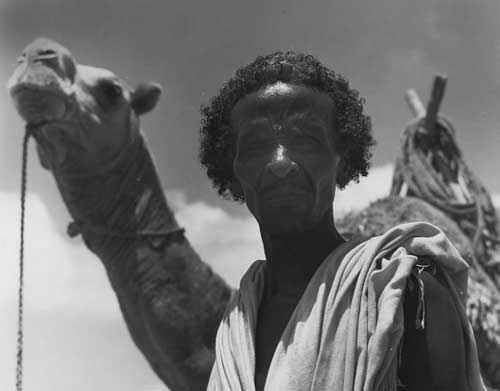

## No xiis no home
1-	There are big questions that are hard to answer when tried head-on, like the question of why there is something rather than nothing. 
But there's a trick you can do, you can make an equivalent question, which is not so hard to answer. I love to simplify the question of why there is something rather than nothing to the question of why the prey run from The Predator. 
This question is still hard; it is a little bit further from us. Let us make it closer. How about why I'm interested in life? 
I think now we have it close, and maybe we can attempt to answer it. 
The experience of being interested in life needs you and the world, and you and the world have to enter into a relationship; this relationship can take many forms and functions, such as the function of breathing. you the organism needs air, and the world, as the environment, provides the oxygen, or you provide something for the environment, like giving Carbon dioxide. we could have so many functions so many relations but if we have abstrct them all what we will have at the end is a union, you and the world become one, and this unity is not unity where were distinctness and uniqueness is demolished it's on the contrary this unity is there to make you shine and to make the world shine, unity in difference you can name this relationship what ever you like but I like to call it love or marriage.

2-	This article is for Somali philosophers and Somali artists, and it's an attempt from me to find our style, and of course, this is something we all should do. 
When I say style, I don't mean the specific music we would make, or the specific poem we would write, or the specific philosophy we want; we should be diverse, diversity is enrichment. What I'm talking about is very specific; it is about the fact that there is a dominant Style in the world, and this style comes from the global north. How we will deal with this fact is a big part of the question of our Style. 
This cold, rough style from the global North started a very long time ago; some say it started with the Greek triad Socrates and his students. Others say it started earlier from Homer's Iliad and Odyssey, it doesn't matter when this is Style started. What matters is to know what its temperament is, and I'm here to share it with you. 

3-	This cold temperament looks far away for what is under its nose; they look for xiis this phenomenal field, this everydayness, but they keep overshooting. And that is what you will not do: you will grasp it, you will express it in your music, your poem, and your philosophy. 
This dynamism between you, the organism, and the environment, this moving love is for you, it is you, and you should never fear it. 
The global North temperament was full of fear; they didn't see the organism and environment, they saw atemporal subject that should use the object, and this exactly is what gives us colonialism and Slavery in America. 

4-	Maybe you're asking yourself what xiis is, and my answer to my friend is that you lost it as soon as you ask the question of what. 
What is justice? What is beauty? Ask the North, and after 2500 years of that question, they killed millions and millions, was that beauty or Justice?. 
The question of "what" is too cold, it depends on differentiation on making what is whole parts and then trying to find the whole in the parts what a Smart Move. 
xiis is around you, above you, below you, you can see it in the smile of the innocence, you can see it in the heroism of the resistor, you can see it in the Majesty of the Acacia  Tree(qudhac). 
Time is the most xiis thing. The northern make it a dead thing with past, present, and future, and they forget, and we remember this is our superpower that we remember that times love and hate, sometimes take away, sometimes give generously.

5-	Ask the Northerner about life, and he will tell you that the measurable is the most important. You see, the measurable gives us new medicine, new communication means, and abundance, but they didn't ask themselves what the use of abundance is if you are not feeling at home. 
That is our style to make you feel at home. Home is our answer to the northerners. 
Capitalism no xiis, national state no xiis, colonialism no xiis, racism no xiis, sexism no xiis. 
no xiis no home.

## Xiis la'aan, Waa Hoy la'aan/Xiis la'aan, Hoy la'aan

1.  Waxaa jira su'aalo waaweyn oo aad u adag in laga jawaabo marka si toos ah loo abbaaro, sida su'aasha ah; maxaa koonku u jiraa beddelkii ay waxba ka jiri lahayn? Laakiin waxaa jirta xirfad aad adeegsan karto, waxaad samayn kartaa su'aal taas u dhiganta, taas oo aan aad u adkayn in laga jawaabo. Anigu waxaan jecelahay in aan fududeeyo su'aasha ah "maxaa wax u jiraan" anigoo ku beddelaya su'aasha ah: maxay ugaartu uga carartaa ugaarsadaha? Su'aashani weli waa adag tahay; in yar bay inaga fog tahay. Aan soo dhaweyno. Ka waran su'aasha ah: maxaan nolosha u xiiseeyaa? Waxaan filayaa in hadda ay inoo dhow dahay, waxaana laga yaabaa in aan isku dayi karno in aan ka jawaabno. Waayo-aragnimada xiisaynta nolosha waxay u baahan tahay adiga iyo dunida, adiga iyo duniduna waa in aad gashaan xiriir; xiriirkani wuxuu yeelan karaa qaabab iyo shaqooyin kala duwan, sida shaqada neefsashada. Adiga oo ah noolaha waxaad u baahan tahay hawo, duniduna sidii deegaan ahaan ayay kuu siisaa Ogsijiin, ama adiga ayaa wax siiya deegaanka oo bixiya Karboon-laba-ogsaydh. Waxaan yeelan karnaa shaqooyin iyo xiriirro aad u badan, laakiin haddii aynu dhammaantood isku ururinno gunteeda, waxa inoo soo baxayaa waa midow; adiga iyo dunida ayaa mid noqonaya. Midowgani ma aha mid burburinaya kala-duwanaanshaha iyo gaar-ahaanshahaaga, liddigeed, midowgani wuxuu u jiraa in uu ku iftiimiyo adiga, dunidana iftiimiyo; waa midow ku dhex jira kala-duwanaansho. Xiriirkan waxaad ugu yeeri kartaa magac kasta oo aad jeceshahay, laakiin anigu waxaan jecelahay in aan ugu yeero Jaceyl ama Guur.

2.  Qormadani waxay u gaar tahay faylasuufyada iyo fannaaniinta/abwaaniinta Soomaaliyeed, waana isku day aan anigu ku baadi-goobayo Habkeena, dabcan, kani waa wax ay tahay in aynu dhammaanteen wada samayno. Markaan leeyahay 'Hab' ama 'Style', ulama jeedo muusig gaarka ah oo aan samayn lahayn, ama gabay gaar ah oo aan qori lahayn, ama falsafad gaar ah oo aan rabno; waa in aan kala duwanaannaa, waayo kala-duwanaanshuhu waa hodantinimada maskaxda. Waxa aan ka hadlayo waa arrin aad u gaar ah; waa xaqiiqada ah in uu jiro 'Hab' ama 'Style' dunida ku awood badan, habkaasna wuxuu ka yimaadaa dalalka Waqooyiga/Reer Galbeedka. Sida aan u wajahayno xaqiiqadan ayaa qayb weyn ka ah su'aasha ku saabsan Habkeena gaarka ah. Habkan qabow ee qallafsan ee ka yimid dalalka Waqooyiga wuxuu bilowday waqti aad u fog; qaar baa leh wuxuu ka bilowday saddexdii faylasuuf ee giriigga ahaa socrates iyo ardaydiisii. Kuwo kalena waxay leeyihiin wuxuu ka sii horreeyay oo ka bilowday buugaagtii Homer ee Iliad iyo Odyssey.
Muhiim ma aha goorta uu habkani bilowday. Waxa muhiimka ah waa in la ogaado dabeecaddiisu waxa ay tahay, waxaana u imid in aan halkan idinla wadaago.

3.  Dabeecaddan qabow waxay meel aad u fog ka raadisaa wixii sankeeda hoostiisa yaala, waxay raadiyaan xiis, fagaarahan muuqda ee la dareemi karo, noloshan maalinlaha ah, laakiin had iyo jeer bartilmaameedka way is-dhaafiyaan. Taasina waa waxa aadan adigu samayn doonin: adigu waad qabsan doontaa, waxaadna ku cabbiri doontaa muusiggaaga, gabaygaaga, iyo falsafaddaada. Dhaqdhaqaaqan socda ee u dhexeeya adiga (noolaha) iyo deegaanka, jaceylkan soconaya adiga ayuu kuu yahay, adiga ayuu ku yahay, waana in aadan waligaa ka baqin. Dabeecadda dalalka waqooyiga cabsi baa ka buuxday; may arkin noolaha iyo deegaanka dabiiciga ah, waxay arkeen qof madax-bannaan oo ka baxsan waqtiga, kaas oo ay tahay in uu isticmaalo walxaha kale, taasina waa xaqiiqada dhabta ah ee inagu keentay gumeysiga iyo adoonsigii ameerika.

4.  Malaha waxaad is-weydiinaysaa waxa uu yahay Xiis, jawaabta aan siinayo saaxiibkayna waa in aad lumisay xiis isla markii aad is-weydiisay su'aasha ah "Waa maxay?". Waa maxay caddaalad? Waa maxay qurux? Weydii dalalka waqooyiga, 2500 oo sano kaddib markii ay su'aashaas is-weydiiyeen, waxay laayeen malaayiin iyo malaayiin qof. Taasi ma qurux baa mise waa caddaalad? Su'aasha ah "Waa maxay" waa mid aad u qabow, waxay ku dhisantahay kala-saarid, in waxa dhammaystiran loo kala googooyo qaybo yaryar, kaddibna la isku dayo in waxii dhammaystirnaa laga dhex raadiyo qaybahaas yar-yar, farsamo caqliyeysan weeyaan! Xiis wuu kugu hareeraysan yahay, kor buu kaa jiraa, hoos buu kaa jiraa, waxaad ka arki kartaa dhoolla-caddaynta ilmaha aan dembiga lahayn, waxaad ka arki kartaa geesinimada qofka iska caabinta samaynaya, waxaadna ka arki kartaa haybadda uu leeyahay geedka qudhacu. Waqtigu waa shayga ugu xiis-ka badan. Reer Waqooyigu waxay waqtiga ka dhigeen shay dhintay oo loo kala qaybiyay tagto, joogto, iyo timaaddo, waana ay illoobaan. Balse innagu waan xusuusannaa, tani waa awoodeena sarraysa, in aan xusuusanno in jaceylka iyo naceybka waqtigu ay mararka qaar wax inaga qaadaan, mararka qaarna ay si deeqsinimo leh wax inoo siiyaan.

5.  Reer waqooyiga weydii waxa ay noloshu tahay, wuxuuna kuu sheegi doonaa in waxa la qiyaasi karo uu yahay waxa ugu muhiimsan. Waad aragtaa, waxa la cabbiri karo wuxuu ina siiyaa dawooyin cusub, habab isgaarsiineed oo cusub, iyo barwaaqo, laakiin ismay weydiin maxay tari barwaaqadu haddii aadan dareemayn in aad dhex joogto hoygaagii iyo gabaadkaagii. Taasi waa Habkeena, in aan ku dareensiinno in aad hoygaagii dhex joogto. Hoygu waa jawaabta aan siinayno reer waqooyiga. Hanti-goosi xiis ma leh, qarannimo dowladeed xiis ma leh, gumeysi xiis ma leh, cunsuriyad xiis ma leh, jinsi-takoor xiis ma leh. Xiis la'aan, Hoy la'aan (No xiis no home).